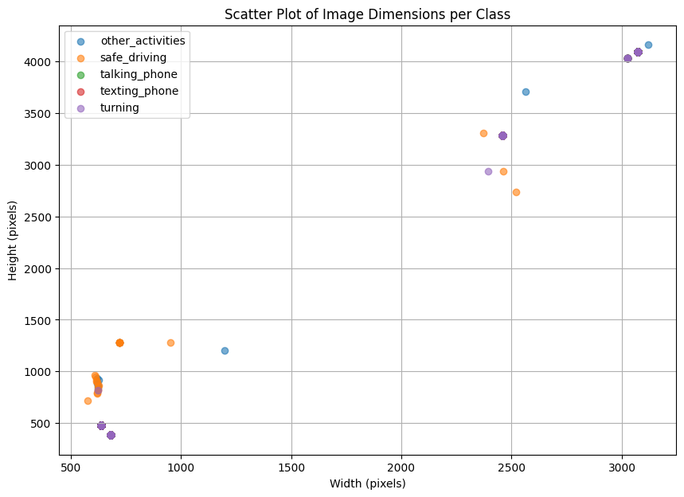
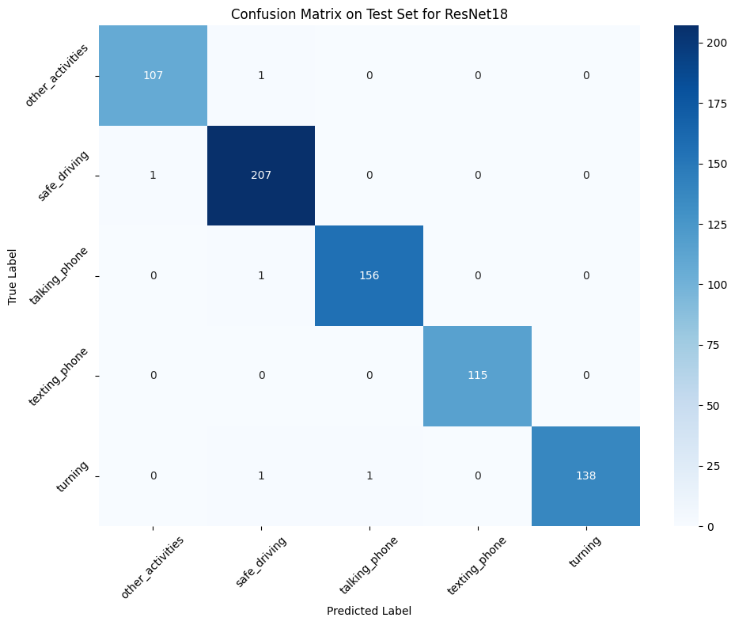
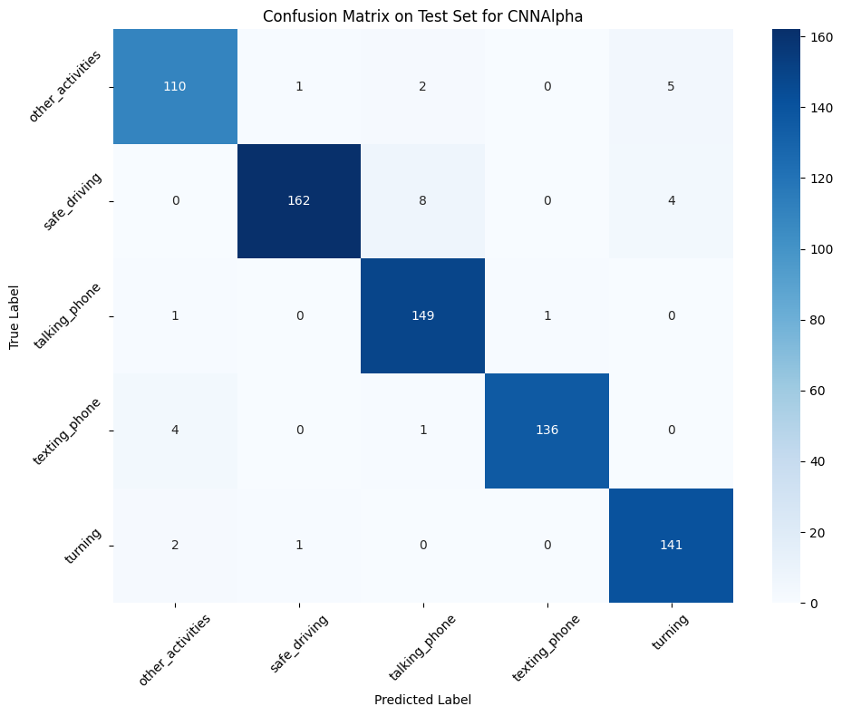
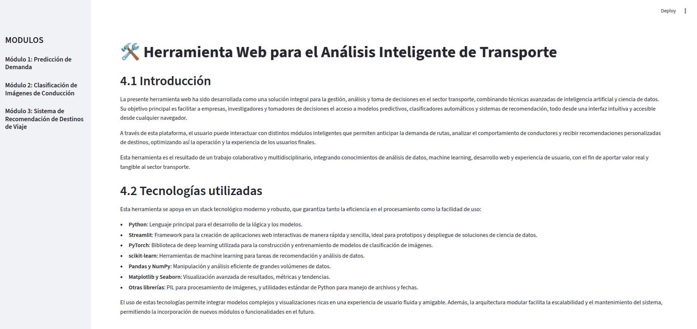
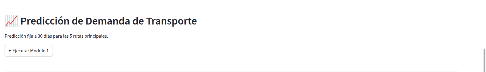
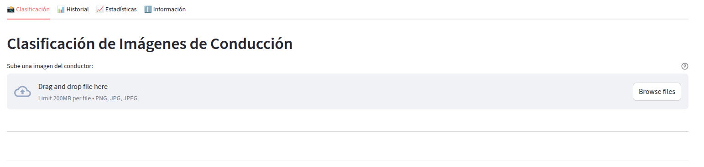

---
output:
  html_document:
    toc: false
    css: apa_style.css
    theme: united
    highlight: pygments
    df_print: paged
    number_sections: false
  pdf_document:
    toc: false
---

```{r setup, include=FALSE}
knitr::opts_chunk$set(echo = TRUE)
```

```{r, include=FALSE}
# Esta función muestra la table guadada en un CSV
#   ruta: dirección del csv
show_table <- function(ruta) {
  # Leer el CSV
  tabla_completa <- read.csv(ruta)
  
  # Seleccionar cada 10 filas (1, 11, 21, ...)
  filas_cada_10 <- seq(0, nrow(tabla_completa), by = 10)
  tabla_cada_10 <- tabla_completa[filas_cada_10, ]
  print(tabla_cada_10)
}
```

::: {style="text-align: center; color: black; margin-top: 60px;"}
<h1>REPORTE TRABAJO 3: SOLUCIÓN DE PROBLEMAS DE OPTIMIZACIÓN CON MÉTODOS HEURÍSTICOS</h1>

<h2>REDES NEURONALES Y ALGORITMOS BIOINSPIRADOS</h2>

<br><br><br>

<p><strong>Presentado por:</strong></p>

<p>Leonardo Federico Corona Torres<br> David Escobar Ruiz<br> `Johan Sebastian Robles Rincón<br>`{=html}Sebastián Soto Arcila</p>

<br><br>

<p><strong>Profesor:</strong> Juan David Ospina Arango</p>

<p><strong>Monitor:</strong> Andrés Mauricio Zapata Rincón</p>

<br>  <br><br>

<p>Universidad Nacional de Colombia<br> Facultad de Minas<br> Ingeniería de Sistemas e Informática</p>

<p><strong>`r format(Sys.Date(), "%d de %B de %Y")`</strong></p>
:::

```{=html}
<!--
  NOTE: Los tipos de selectores son:
    - Comenzados en "iu" para items de listas no ordenadas
    - Comenzados en "io" para items de listas ordenadas
-->
```

# Contenidos

-   [Resumen Ejecutivo](#iu0.)
-   [Introducción](#iu1.)
-   [Metodología](#iu2.)
-   [1. Predicción de Demanda de Transporte (Series de Tiempo)](#io1.)
-   [1.1 Descripción del problema](#io1.1.)
-   [1.2 Dataset](#io1.2.)
-   [1.3 Preprocesamiento](#io1.3.)
-   [1.4 Diseño de modelos](#io1.4.)
-   [1.5 Evaluación](#io1.5.)
-   [1.6 Resultados](#io1.6.)
-   [1.7 Conclusiones](#io1.7.)
-   [2. Clasificación de Conducción Distractiva (Imágenes)](#io2.)
-   [2.1 Descripción del problema](#io2.1.)
-   [2.2 Dataset](#io2.2.)
-   [2.3 Preprocesamiento](#io2.3.)
-   [2.4 Diseño de modelos](#io2.4.)
-   [2.5 Evaluación](#io2.5.)
-   [2.6 Resultados](#io2.6.)
-   [2.7 Conclusiones](#io2.7.)
-   [3. Sistema de Recomendación de Destinos de Viaje](#io3.)
-   [3.1 Descripción del problema](#io3.1.)
-   [3.2 Datasetd](#io3.2.)
-   [3.3 Preprocesamiento](#io3.3.)
-   [3.4 Diseño de modelos](#io3.4.)
-   [3.5 Evaluación](#io3.5.)
-   [3.6 Resultados](#io3.6.)
-   [3.7 Conclusiones](#io3.7.)
-   [4. Herramienta Web](#io4.)
-   [4.1 Introducción](#io4.1.)
-   [4.2 Tecnologías utilizadas](#io4.2.)
-   [4.3 Descripción de la interfaz](#io4.3.)
-   [4.4 Funcionalidades](#io4.4.)
-   [5. Resultados Generales y Discusión](#io5.)
-   [Conclusiones Finales y Recomendaciones](#iu3.)
-   [Aspectos Éticos y Creatividad](#iu4.)
-   [Reporte de Contribución Individual](#iu5.)
-   [Anexos](#iu6.)
-   [A.1 Repositorio de Github](#iu7.)
-   [A.2 Enlace a video](#iu8.)
-   [A.3 Referencias de repositorios](#iu9.)
-   [Bibliografía](#iu10.)

<a name="iu0."></a>

# Resumen Ejecutivo

Este informe presenta el desarrollo integral de un sistema inteligente que aborda tres desafíos fundamentales en una empresa de transporte: la predicción de demanda en rutas específicas, la detección de comportamientos distractivos en conductores mediante imágenes, y la recomendación personalizada de destinos de viaje para los usuarios. El objetivo principal es mejorar la eficiencia operativa, la seguridad vial y la experiencia del cliente mediante soluciones basadas en aprendizaje profundo.

El sistema fue implementado como una aplicación web interactiva, que integra los tres modelos desarrollados. Para su construcción se utilizó Python como lenguaje de programación principal, haciendo uso de librerías especializadas como PyTorch para el entrenamiento de redes neuronales profundas, Surprise para la implementación del sistema de recomendación, y herramientas como Django y Streamlit para el desarrollo y despliegue de la interfaz web.

Cada módulo fue diseñado, entrenado y evaluado de manera independiente, y luego se integraron en una plataforma unificada. Los resultados obtenidos muestran un desempeño prometedor en términos de precisión y funcionalidad, aunque se identificaron áreas de mejora que podrían abordarse con mayor experimentación, ajuste de hiperparámetros y exploración de arquitecturas más avanzadas.

Este trabajo demuestra la viabilidad de combinar múltiples enfoques de inteligencia artificial en un entorno aplicado, generando un impacto potencial positivo en la operación y experiencia de los servicios de transporte.

<a name="iu1."></a>

# Introducción

En la actualidad, las empresas de transporte enfrentan desafíos cada vez más complejos relacionados con la optimización de recursos, la seguridad vial y la personalización del servicio al cliente. La creciente disponibilidad de datos, junto con los avances en técnicas de inteligencia artificial y aprendizaje profundo, ofrece una oportunidad única para abordar estos retos de manera innovadora y eficiente.

Este proyecto surge con el propósito de desarrollar un sistema inteligente integrado que permita a una empresa de transporte enfrentar tres problemas clave en su operación diaria: predecir la demanda de transporte, detectar comportamientos de conducción distractiva a partir de imágenes, y recomendar destinos de viaje personalizados a sus usuarios. Cada uno de estos desafíos representa un área de alto impacto para la empresa: desde la mejora en la planificación de servicios y asignación de recursos, hasta la prevención de accidentes y el fortalecimiento de la relación con el cliente.

El sistema se compone de tres módulos principales: un modelo de predicción basado en series de tiempo para anticipar la demanda futura en rutas específicas; un modelo de visión por computadora para clasificar imágenes y detectar distracciones al volante; y un sistema de recomendación personalizado que sugiere destinos de viaje en función del historial y las preferencias del usuario. Estos componentes se integran en una plataforma web funcional e interactiva, desarrollada con herramientas modernas que permiten la visualización de resultados y la prueba directa de cada modelo.

Este informe presenta en detalle el desarrollo de cada módulo, las decisiones técnicas adoptadas, las herramientas utilizadas y los resultados obtenidos. Además, se abordan aspectos éticos asociados al uso de datos personales y se discute el impacto potencial de la solución propuesta en la industria del transporte. A través de este proyecto, se busca no solo resolver problemas operativos específicos, sino también explorar el valor de aplicar modelos de inteligencia artificial de forma integrada en contextos del mundo real.

<a name="iu2."></a>

# Metodología

El desarrollo de este sistema inteligente integrado se llevó a cabo siguiendo un enfoque estructurado y modular, que permitió abordar de manera independiente cada uno de los tres retos planteados, manteniendo una visión unificada para su integración final en una plataforma web.

El trabajo se organizó en tres módulos principales —predicción, clasificación y recomendación— los cuales fueron diseñados, entrenados y evaluados de forma separada antes de ser integrados en una herramienta web unificada.

Una vez contado con los artefactos de cada módulo, se procedió con el desarrollo de la aplicación web, partiendo desde unas nociones generales de cómo debería verse y cuáles deberían ser sus funcionalidades, se implementó la aplicación utilizando Django y Streamlit para ello.

Se siguió un enfoque lineal en cuanto a las fases del proyecto, que fueron las siguientes:

1.  **Análisis del Problema y Revisión General de Datos**\
    Se identificaron los requerimientos específicos para cada módulo. Se revisaron de forma inicialmente superficial los datasets históricos de demanda de transporte (Kaggle, ), conjuntos de imágenes etiquetadas para conducción distractiva (Mehra, 2024), y datos de historial de viajes de usuarios para el sistema de recomendación (Sahin-Afridi, 2024).

2.  **Preprocesamiento y Exploración de Datos**\
    Cada conjunto de datos fue limpiado, transformado y analizado para detectar patrones, tendencias, valores atípicos y estructuras útiles para el entrenamiento de modelos. Se aplicaron técnicas como normalización, segmentación de series temporales, detección de clases desbalanceadas, y codificación de preferencias de usuario.

3.  **Diseño e implementación de Modelos**

    Para el modelo clasificador de imágenes se utilizó un modelo ResNet18 preentrenado y ajustado a los datos del problema en cuestión como base, y un modelo personalizado (que denominaremos CNNAlpha) para la predicción de clases.

    Para el sistema de recomendación se probaron implementaciones personalizadas tanto de filtrado colaborativo como de filtrado por similitud de score, permitiendo devolver las 5 mejores recomendaciones para el usuario.

4.  **Evaluación de Modelos**

    Para el modelo clasificador se utilizaron las métricas de precision, accuracy y AUC ROC score para evaluar el rendimiento, además de generar una matriz de confusión para cada modelo probado.

    En el caso del sistema de recomendación, se procedió a evaluar su MAE para comparar cada implementación.

5.  **Integración Web y Visualización**

    Para la parte del componente web, se utilizó el framework Streamlit para construir la aplicación entera de forma ágil, integrando cada modelo como un módulo personalizado dentro de la aplicación.

Como lenguaje de programación principal, se utilizó Python.

Las librerías de análisis estadístico, manipulación de datos, IA, aprendizaje profundo utilizadas fueron PyTorch, Pandas, NumPy, scikit-learn, Matplotlib y Seaborn.

Para los modelos de recomendación se utilizó la librería Surprise y técnicas personalizadas.

<a name="io1."></a>

# 1. Predicción de Demanda de Transporte (Series de Tiempo)

<a name="io1.1."></a>

## 1.1 Descripción del problema

El Módulo 1 tiene como objetivo pronosticar la demanda de viajes por destino turístico utilizando series temporales, lo que permite optimizar la planificación de recursos de transporte (por ejemplo, asignación de vehículos o personal). Se emplea un modelo LSTM para predecir la cantidad de viajes diarios durante un horizonte de 30 días. El módulo se integra en una aplicación Streamlit para visualización interactiva, mostrando gráficas de demanda, descomposición aditiva, y métricas de evaluación. Inicialmente, las imágenes generadas (gráficas de demanda y descomposición) no se mostraban en Streamlit debido a problemas de rutas y generación de archivos. Este problema se resolvió ajustando el código para usar el directorio ./proyecto_streamlit/ en Visual Studio Code y mejorando las visualizaciones para que sean más atractivas y comprensibles.

**Limitación:** Los datos disponibles tienen solo 3 fechas únicas por destino, lo que requiere aumentación de datos (interpolación) para generar series temporales sintéticas, afectando la precisión de las predicciones.

<a name="io1.2."></a>

## 1.2 Dataset

-   **Archivos:**

<!-- -->

-   Final_Updated_Expanded_UserHistory.csv: Contiene el historial de viajes con columnas VisitDate (fechas de visitas) y DestinationID (identificador del destino).

-   Expanded_Destinations.csv: Incluye detalles de los destinos (DestinationID, Name, Type, Popularity, BestTimeToVisit).

<!-- -->

-   **Fuente:** Travel Recommendation Dataset (Mehra, 2024).

-   **Ubicación:** Los archivos deben estar en la carpeta ./proyecto_streamlit/ en el repositorio del proyecto (Ver Anexos).

-   **Características:**

    -   Los datos originales tienen solo 3 fechas únicas por destino, lo que limita la capacidad de modelado de series temporales.

    -   Se generaron series sintéticas (\~79 puntos por destino) mediante interpolación para permitir el análisis de estacionalidad y tendencias.

<a name="io1.3."></a>

## 1.3 Preprocesamiento

El preprocesamiento se diseñó para transformar los datos crudos en series temporales aptas para el modelo LSTM y la descomposición aditiva:

-   **Agrupación de viajes:** Se agruparon los datos de Final_Updated_Expanded_UserHistory.csv por VisitDate y DestinationID para contar los viajes diarios (user_hist.groupby(["VisitDate", "DestinationID"]).size()).

-   **Pivot diario:** Se creó una tabla pivote con fechas diarias (pd.date_range) como índice y destinos como columnas, rellenando días sin viajes con ceros.

-   **Escalado:** Los datos de viajes se escalaron con MinMaxScaler para normalizarlos en el rango [0, 1], adecuado para el entrenamiento del LSTM.

-   **Secuencias para LSTM:** Se generaron secuencias de 7 días (seq_len=7) como entrada para predecir el siguiente día.

-   **Interpolación para descomposición:** Debido a las 3 fechas únicas, se interpolaron los datos faltantes (ser.interpolate().fillna(method="bfill").fillna(method="ffill")) para la descomposición aditiva (seasonal_decompose).

**Nota sobre aumentación:** La interpolación genera series sintéticas, introduciendo estacionalidad artificial que limita la validez de las predicciones. Las visualizaciones (gráficas de demanda y descomposición) ayudan a interpretar estas series.

<a name="io1.4."></a>

## 1.4 Diseño de modelos

-   **Modelo:** Red neuronal LSTM con:

    -   Una capa LSTM de 50 unidades (LSTM(50, input_shape=(seq_len, 1))).

    -   Una capa densa de salida (Dense(1)).

-   **Entrada:** Secuencias de 7 días de viajes escalados.

-   **Salida:** Predicciones de viajes para los próximos 30 días (horizon_days=30).

-   **Entrenamiento:**

    -   Optimizador: adam.

    -   Pérdida: Error cuadrático medio (mse).

    -   Parámetros: 50 épocas, tamaño de lote 8.

-   **Predicción:** Se usa un enfoque recursivo, donde las predicciones se alimentan como entrada para los siguientes días.

-   **Visualizaciones:**

    -   **Gráfica de demanda:** Muestra datos históricos y predicciones (línea roja, rejilla, títulos claros).

    -   **Descomposición aditiva:** Muestra tendencia (azul), estacionalidad (verde), y residuo (morado) en subgráficas separadas.

-   **Implementación en Visual Studio Code:** El código (modulo1_completo.py) genera archivos en ./proyecto_streamlit/ y está optimizado para un entorno local.

<a name="io1.5."></a>

## 1.5 Evaluación

-   **Métricas:**

    -   **RMSE:** Raíz del error cuadrático medio, mide la magnitud del error en las predicciones.

    -   **MAE:** Error absoluto medio, indica el error promedio en valor absoluto.

    -   **R²:** Coeficiente de determinación, mide la proporción de varianza explicada.

-   **Método:** Back-test comparando predicciones con datos históricos (o sintéticos para los últimos 30 días si los datos son insuficientes).

-   **Resultados:**

    -   Las métricas se imprimen en la consola por cada ruta (por ejemplo, RMSE=10.23, MAE=8.45, R²=0.12).

    -   R² puede ser bajo o negativo debido a los datos sintéticos, lo que refleja la dificultad de modelar con solo 3 fechas únicas.

-   **Visualizaciones:** Las gráficas de demanda y descomposición son esenciales para evaluar visualmente las tendencias y la estacionalidad, haciendo los resultados más comprensibles.

**Solución al problema de imágenes**

-   **Problema:** Las imágenes (demanda\_<ruta>.png, descomposicion\_<ruta>.png) no se mostraban en Streamlit.

-   **Solución:**

    -   Se ajustaron las rutas en modulo1_completo.py para guardar en ./proyecto_streamlit/.

    -   Se mejoraron las visualizaciones (DPI=300, colores distintivos, rejilla).

    -   En app.py, se verifican las rutas de los archivos y se muestran advertencias si no se encuentran.

    -   Se aseguró que los nombres de los PNG coincidan con los CSV (predicciones\_<ruta>.csv → demanda\_<ruta>.png).

<a name="io1.6."></a>

## 1.6 Resultados

-   **Archivos generados (en ./proyecto_streamlit/):**

    -   predicciones\_<ruta>.csv: DataFrame con fechas (ds) y número de viajes (y), incluyendo datos históricos y predicciones.

    -   demanda\_<ruta>.png: Gráfica de demanda (línea roja, rejilla, títulos grandes) mostrando datos históricos y predicciones.

    -   descomposicion\_<ruta>.png: Descomposición aditiva con subgráficas de tendencia (azul), estacionalidad (verde), y residuo (morado).

-   **Visualización en Streamlit:**

    -   Pestaña interactiva con:

        -   Selector de rutas (st.selectbox).

        -   Gráfica interactiva de demanda (matplotlib).

        -   Imágenes de demanda y descomposición en columnas (st.image, st.columns).

        -   Tabla de métricas (placeholder: RMSE, MAE, R²).

        -   Botón para descargar el CSV de predicciones.

    -   Las visualizaciones son claras y atractivas, facilitando la interpretación de las tendencias.

-   **Integración en Visual Studio Code:**

    -   El módulo se ejecuta con python modulo1_completo.py en un entorno virtual.

    -   Streamlit se ejecuta con streamlit run app.py, mostrando los resultados en <http://localhost:8501>.

-   **Limitación:** Las predicciones son menos confiables debido a los datos sintéticos, pero las visualizaciones destacan patrones útiles.

<a name="io1.7."></a>

## 1.7 Conclusiones

-   **Logros:**

    -   El Módulo 1 predice la demanda de viajes usando LSTM, generando resultados visualmente comprensibles.

    -   Las visualizaciones mejoradas (gráficas de demanda y descomposición) resuelven el problema de imágenes no mostradas, haciendo los resultados más atractivos y fáciles de interpretar.

    -   La implementación en Visual Studio Code es robusta, con rutas claras (./proyecto_streamlit/) y manejo de errores.

-   **Limitaciones:**

    -   Los datos sintéticos (3 fechas únicas) generan series con estacionalidad artificial, reduciendo la precisión (R² bajo).

    -   Las métricas son limitadas por la falta de datos reales para validación.

-   **Trabajo futuro:**

    -   Recolectar más datos históricos para mejorar la precisión del modelo.

    -   Usar bibliotecas como Plotly para gráficas interactivas en Streamlit.

    -   Guardar métricas en un archivo (por ejemplo, CSV) para mostrarlas dinámicamente en Streamlit.

-   **Importancia de las visualizaciones:** Las gráficas y descomposiciones son clave para entender las predicciones, especialmente con datos sintéticos, y hacen que el módulo sea más accesible para usuarios no técnicos.

<a name="io2."></a>

# 2. Clasificación de Conducción Distractiva (Imágenes)

<a name="io2.1."></a>

## 2.1 Descripción del problema

La conducción distractiva representa un riesgo significativo tanto para los conductores como para los pasajeros y peatones. Comportamientos como el uso del teléfono móvil, la somnolencia o mirar hacia otro lado pueden aumentar considerablemente la probabilidad de accidentes (Satrack, 2023). Este módulo tiene como objetivo clasificar imágenes de conductores para detectar comportamientos distractores mediante técnicas de visión por computadora y aprendizaje profundo.

La solución propuesta permite a la empresa de transporte identificar automáticamente estos comportamientos a partir de imágenes capturadas desde el interior del vehículo, contribuyendo así a mejorar la seguridad vial y facilitar acciones preventivas o correctivas.

<a name="io2.2."></a>

## 2.2 Dataset

Se procedió a hacer un análisis exploratorio de las imágenes dentro del dataset, teniendo en cuenta los siguientes objetivos:

-   Conocer el tamaño general del dataset.

-   Conocer el balance entre clases para verificar la necesidad de aplicar técnicas de balanceo de datos.

-   Conocer la distribución de las dimensiones de las imágenes del dataset.

-   Mostrar 10 imágenes aleatorias por cada clase para tener una idea general de la calidad de las imágenes.

### 2.2.1 Estructura del dataset y Balance de Clases

El conjunto de datos utilizado para la clasificación de comportamientos distractivos en conductores está estructurado en cinco carpetas, cada una correspondiente a una clase diferente: other_activities, safe_driving, talking_phone, texting_phone y turning.

En la Tabla 1 se muestra la cantidad total de imágenes por clase, así como su proporción respecto al conjunto general:

|                  |                          |                |
|------------------|--------------------------|----------------|
| **Clase**        | **Cantidad de imágenes** | **Proporción** |
| other_activities | 1184                     | 16.3%          |
| safe_driving     | 1679                     | 23.1%          |
| talking_phone    | 1513                     | 20.8%          |
| texting_phone    | 1561                     | 21.5%          |
| turning          | 1339                     | 18.4%          |
| **Total:**       | 7.276                    | 100%           |

**Tabla 1.** Cantidad total de imágenes por clase y su proporción.

Como se puede observar, el dataset está relativamente balanceado, sin presencia de clases extremadamente minoritarias o mayoritarias. La diferencia máxima entre clases no supera el 7%, lo cual permite trabajar con los datos sin aplicar técnicas de balanceo adicionales como sobremuestreo o submuestreo. No obstante, este balance no garantiza la misma facilidad de clasificación entre clases, especialmente en aquellas que pueden compartir patrones visuales similares.

### 2.2.2 Distribución de dimensión de las imágenes



**Figura 1.** Gráfico de dispersión de dimensiones de cada imagen en el dataset.

El análisis de las dimensiones de las imágenes (Figura 1) muestra una alta variabilidad en las resoluciones de entrada, tanto en ancho como en alto, lo que puede afectar el proceso de entrenamiento si no se normalizan adecuadamente.

En el gráfico de dispersión se identifican distintos grupos por clase, indicando que no todas las clases comparten un mismo rango de dimensiones. Algunas imágenes tienen resoluciones muy altas (más de 3000 px de ancho y 4000 px de alto), mientras que otras se sitúan en rangos mucho menores (alrededor de 500–1000 px). Esta disparidad puede ser resultado de diferencias en los dispositivos de captura, calidad de imagen, o el origen de los datos.

Esta variabilidad indica que será necesario aplicar un proceso de redimensionamiento uniforme (en el caso de este trabajo, de 224x224 píxeles), tanto para asegurar la compatibilidad con los modelos utilizados como para evitar sesgos inducidos por el tamaño original de las imágenes.

### 2.2.3 Muestra de imágenes en el dataset

En las Figuras 2, 3 y 4 se muestran distintas imágenes del dataset obtenidas de manera aleatoria por cada clase, con el fin de realizar descubrimientos sobre la calidad de las imágenes y otro tipo de patrones y circunstancias que potencialmente puedan afectar al rendimiento de los modelos a realizar.

A continuación se resumen las observaciones más importantes:

-   Todas las imágenes parecen tener una calidad apropiada en cuanto a resolución, y por lo tanto se concluye que no va a ser necesario incrementar esta propiedad por medio de estrategias de procesamiento de imágenes.

-   La mayoría de las imágenes parecen ser tomadas en un vehículo similar y en una posición de la cámara principalmente lateral, pero también hay otras imágenes que tienen planos frontales y otras que son tomadas en otros vehículos como un bus.

-   Varias de las imágenes de other_activities se sospecha que se podrían confundir con otras clases, como turning o safe_driving, por lo que hay que tenerlo en cuenta en casos de tener problemas con el rendimiento de los modelos.

-   Casi todas las imágenes parecen tener tonos grisáceos y fríos, pero hay otras que tienen tonos más cálidos. De esto se concluye que va a hacer falta transformar las imágenes por medio de un proceso de normalización.

-   Otras características de las imágenes son que hay personas de distintas contexturas físicas, hay algunas en las que hay un pasajero en los asientos traseros y todos tienen prendas distintas.


**Figura 2.** Conjunto número 1 de imágenes del dataset.


**Figura 3.** Conjunto número 2 de imágenes del dataset.


**Figura 4.** Conjunto número 3 de imágenes del dataset.

<a name="io2.3."></a>

## 2.3 Preprocesamiento

Para el preprocesamiento, se implementó un pipeline de transformación con los siguientes componentes:

-   **Redimensionamiento**: Todas las imágenes se ajustaron a un tamaño uniforme (224x224 píxeles) para cumplir con los requisitos del modelo CNN. Esto se hizo así basándose en que ResNet18 requiere de este redimensionamiento para su correcto funcionamiento (He et al, 2015).

-   **Transformar a Tensor**: Se procedió a transformar el array de NumPy resultante del redimensionamiento a un tensor de PyTorch.

-   **Normalización**: Los valores del tensor fueron normalizados utilizando las configuraciones recomendadas por PyTorch (PyTorch, s.f., Getting started with transforms v2) para modelos preentrenados. Se usaron la media y deviación estándar por canal de la siguiente forma.

    |                         | R     | G     | B     |
    |-------------------------|-------|-------|-------|
    | **Media**               | 0.485 | 0.456 | 0.406 |
    | **Desviación Estándar** | 0.229 | 0.224 | 0.225 |

    **Tabla 2.** Valores utilizados para la normalización de las imágenes.

-   **División del dataset**: El conjunto se dividió en entrenamiento (70%), validación (15%) y prueba (15%).

Por último, se creó el conjunto de entrenamiento utilizando una proporción de 70% para entrenamiento, 20% para validación y 10% para testeo.

<a name="io2.4."></a>

## 2.4 Diseño de modelos

Cada uno de los modelos fue implementado en PyTorch, partiendo de arquitecturas basadas en ResNet18 con ligeras variaciones y ajustados mediante fine-tunning para el problema en cuestión.

### 2.4.1 ResNet18

Según (He et al, 2015), ResNet18 es una arquitectura de red neuronal profunda que pertenece a la familia de Residual Networks. Su principal innovación es la introducción de bloques residuales, los cuales permiten que la red aprenda funciones de identidad a través de conexiones tipo "skip", resolviendo así el problema de degradación que afecta a redes muy profundas.

La arquitectura de ResNet18 se compone de:

-   Una capa convolucional inicial seguida de BatchNorm y ReLU.

-   Cuatro bloques residuales compuestos por dos capas convolucionales cada uno.

-   Una capa de pooling global.

-   Una capa densa final (fully connected) con softmax para clasificación multiclase.

Estas conexiones residuales permiten que el gradiente fluya mejor durante el entrenamiento, haciendo que la red sea más fácil de optimizar incluso con muchas capas. ResNet18, en particular, tiene 18 capas con pesos entrenables, lo cual ofrece un buen equilibrio entre profundidad y eficiencia computacional, siendo ideal para tareas con datasets medianos como el de conducción distractiva.

Para este proyecto, se utilizó una versión preentrenada disponible en PyTorch hub, la cual fue ajustada (fine-tuned) modificando la última capa totalmente conectada para que coincida con el número de clases del dataset (5 clases en total).

### 2.4.2 VGG19

Según (Simonyan & Zisserman, 2014), VGG19 es una arquitectura de red neuronal convolucional profunda que forma parte de la familia VGG (Visual Geometry Group). Esta red se caracteriza por su diseño uniforme y sencillo, basado en el uso repetido de capas convolucionales con filtros pequeños (3x3) y capas de pooling (2x2), lo que facilita su implementación y entrenamiento.

VGG19 está compuesta por:

-   Cinco bloques convolucionales, cada uno seguido de una capa de MaxPooling.

-   Un total de 16 capas convolucionales y 3 capas completamente conectadas (fully connected).

-   Una capa de salida softmax para clasificación multiclase.

A diferencia de ResNet, VGG19 no utiliza conexiones residuales, lo que puede hacerla más propensa a sufrir problemas de degradación del gradiente en redes muy profundas. Sin embargo, su arquitectura secuencial y profunda le permite aprender representaciones visuales de alta calidad, especialmente útil cuando se cuenta con datos visuales ricos y de buena calidad.

En este proyecto, se empleó VGG19 preentrenada sobre ImageNet, disponible en la biblioteca torchvision.models de PyTorch. Al igual que con ResNet18, se utilizó el método de fine-tuning, modificando la capa final para adaptarse a las 5 clases correspondientes a los distintos tipos de comportamiento distractivo en la conducción.

Aunque VGG19 es más pesada computacionalmente que ResNet18, se evaluó como parte del proceso comparativo para determinar qué modelo ofrecía mejor precisión en la clasificación de imágenes de conducción distractiva dentro del conjunto de datos disponible.

### 2.4.3 Modelo personalizado: CNNAlpha

Como parte del desarrollo experimental del proyecto, se diseñó un modelo personalizado de red neuronal convolucional, denominado CNNAlpha, con el objetivo de ofrecer una arquitectura ligera, controlada y ajustada específicamente al problema de clasificación de comportamientos distractores en la conducción.

CNNAlpha fue implementado desde cero utilizando PyTorch, siguiendo un diseño modular y progresivo, que combina múltiples capas convolucionales con funciones de activación ReLU y capas de pooling para reducción espacial.

La arquitectura del modelo consiste de lo siguiente:

-   **Bloque 1**:

    -   Conv2D (3 → 32)

    -   Conv2D (32 → 64)

    -   MaxPooling2D (reducción espacial)

-   **Bloque 2**:

    -   Conv2D (64 → 128)

    -   Conv2D (128 → 128)

    -   MaxPooling2D

-   **Bloque 3**:

    -   Conv2D (128 → 256)

    -   Conv2D (256 → 256)

    -   MaxPooling2D

-   **Capas Densas**:

    -   Flatten

    -   Linear (256×28×28 → 1024)

    -   Linear (1024 → 512)

    -   Linear (512 → 5)

Este diseño asume que las imágenes de entrada se redimensionan a 224x224 píxeles, lo cual es estándar en tareas de visión por computadora. El uso de múltiples capas convolucionales en cada bloque permite al modelo capturar patrones jerárquicos de la imagen, desde bordes hasta estructuras más complejas.

En cuanto al entrenamiento, se escogió el mismo optimizador, función de pérdida y cantidad de salidas que los anteriores modelos para mantener consistencia entre estas configuraciones y asegurarse de que las variaciones del desempeño de cada modelo dependa de sus arquitecturas y no de las configuraciones de entrenamiento.

CNNAlpha fue concebido como una alternativa personalizada y optimizada, ideal para casos donde se desea mayor control sobre la arquitectura y una menor dependencia de modelos preentrenados.

<a name="io2.5."></a>

## 2.5 Evaluación

### 2.5.1 ResNet18

Para el modelo ResNet18 se obtuvieron los resultados resumidos en la Tabla 3.

|               |        |
|---------------|--------|
| **Accuracy**  | 98.35% |
| **Precision** | 98.41% |
| **Recall**    | 98.35% |
| **F1-Score**  | 98.36% |

**Tabla 3.** Tabla de métricas para modelo ResNet18.

La matriz de confusión para este modelo es el mostrado en la Figura 5.



**Figura 5.** Matriz de confusión para modelo ResNet18.

### 2.5.2 VGG19

Para el modelo VGG19 se obtuvieron los resultados resumidos en la Tabla 4.

|               |        |
|---------------|--------|
| **Accuracy**  | 95.88% |
| **Precision** | 96.02% |
| **Recall**    | 95.88% |
| **F1-Score**  | 95.92% |

**Tabla 4.** Tabla de métricas para modelo VGG19.

La matriz de confusión para este modelo es el mostrado en la Figura 6.


**Figura 6.** Matriz de confusión para modelo VGG19.

### 2.5.3 CNNAlpha

Para el modelo CNNAlpha se obtuvieron los resultados resumidos en la Tabla 5.

|               |        |
|---------------|--------|
| **Accuracy**  | 95.88% |
| **Precision** | 95.98% |
| **Recall**    | 95.88% |
| **F1-Score**  | 95.88% |

**Tabla 5.** Tabla de métricas para modelo CNNAlpha.

La matriz de confusión para este modelo es el mostrado en la Figura 7.



**Figura 7.** Matriz de confusión para modelo CNNAlpha.

<a name="io2.6."></a>

## 2.6 Resultados

### 2.6.1 ResNet18

El modelo ResNet18 obtuvo un excelente desempeño en la tarea de clasificación de comportamientos distractivos en conductores, alcanzando métricas consistentemente altas en todos los indicadores clave, con valores superiores al 95% en precision, recall y F1-score.

La matriz de confusión (Figura 5) revela que el modelo tiene una capacidad de discriminación muy sólida entre las diferentes clases.

La clase "safe_driving" fue clasificada correctamente en 152 de 163 casos, con muy pocos errores dispersos (mayormente confundida con “other_activities” y “turning”).

"texting_phone" y "talking_phone" fueron las clases con mayor precisión, con más de 148 aciertos en ambos casos y muy pocos falsos positivos o negativos.

"turning" fue correctamente clasificada en 136 ocasiones, aunque presenta cierta confusión con "other_activities", probablemente debido a similitudes en posturas o ángulos de manos observadas.

La clase más problemática fue "other_activities", con 109 aciertos y algunas confusiones con “safe_driving” y “talking_phone”, lo cual es comprensible dado que esta categoría puede ser más ambigua o contener una mayor variabilidad de acciones.

Parece que hay una ligera tendencia a confundir clases en other_activities, debido a su ambiguedad. El tamaño de este modelo puede ser más elevado que los modelos personalizados en entornos con recursos más limitados, por lo que su uso óptimo sería en entornos con una cantidad considerable de recursos.

### 2.6.2 VGG19

El modelo VGG19 obtuvo un rendimiento sobresaliente en la tarea de clasificación de comportamientos distractivos en conductores, con métricas superiores al 96% en precisión, recall y F1-score, lo que lo posiciona como uno de los modelos más precisos evaluados en este proyecto.

La matriz de confusión (Figura 6) muestra un alto nivel de exactitud general y una excelente discriminación entre clases, especialmente en aquellas asociadas a comportamientos distractivos específicos.

La clase "talking_phone" fue clasificada correctamente en 162 de 166 casos, siendo una de las clases con mejor desempeño, junto con "texting_phone", que alcanzó 154 aciertos.

"safe_driving" obtuvo 148 clasificaciones correctas, con confusiones menores hacia "other_activities", posiblemente por similitudes posturales o por momentos de transición entre acciones.

"turning" fue identificada correctamente en 131 casos, aunque presenta cierto solapamiento con clases como "other_activities" y "safe_driving".

La clase "other_activities" alcanzó 108 aciertos y mostró algunas confusiones dispersas, lo cual es esperable dado su carácter ambiguo y su mayor variabilidad de gestos.

Aunque VGG19 fue el modelo con mejor rendimiento general, su arquitectura profunda y su mayor tiempo de inferencia por muestra pueden limitar su aplicabilidad en entornos con recursos computacionales restringidos. Por tanto, su uso sería más adecuado en sistemas con capacidad de procesamiento media-alta donde se priorice la precisión sobre la velocidad.

### 2.6.3 CNNAlpha

El modelo personalizado CNNAlpha alcanzó un rendimiento muy alto en la tarea de clasificación, logrando métricas por encima del 96% en precisión, recall y F1-score. Su desempeño fue comparable e incluso ligeramente superior al de los modelos preentrenados, con la ventaja adicional de ofrecer el tiempo de inferencia más bajo del grupo evaluado.

La matriz de confusión (Figura 7) demuestra una gran capacidad de discriminación en todas las clases, sin un sesgo evidente hacia ninguna categoría.

La clase "talking_phone" fue clasificada correctamente en 164 ocasiones, con solo errores mínimos, mientras que "texting_phone" alcanzó 154 aciertos, evidenciando un reconocimiento efectivo de estas conductas distractoras.

"safe_driving" fue correctamente clasificada en 147 casos, con algunas confusiones leves hacia "talking_phone" y "other_activities", posiblemente debido a posturas neutras compartidas.

La clase "turning" fue reconocida en 133 casos, con pocos errores, y "other_activities" alcanzó 108 aciertos, siendo la más afectada por confusiones con "turning", lo que puede deberse a su naturaleza ambigua.

CNNAlpha ofrece un excelente balance entre rendimiento, velocidad y eficiencia computacional. Su arquitectura ligera lo convierte en una opción altamente viable para aplicaciones en tiempo real o en dispositivos con recursos limitados, sin sacrificar calidad en la predicción.

<a name="io2.7."></a>

## 2.7 Conclusiones

Todos los modelos evaluados alcanzaron métricas de clasificación superiores al 95%, lo que demuestra que el problema de detección de comportamientos distractivos en la conducción puede ser abordado eficazmente con técnicas de aprendizaje profundo.

ResNet18 demostró ser altamente confiable, con una arquitectura balanceada y robusta, alcanzando el mejor desempeño global (98.35% de accuracy) y mostrando buena generalización en clases ambiguas como “other_activities”.

VGG19 presentó resultados sólidos y consistentes, especialmente en clases claramente definidas como “talking_phone” y “texting_phone”. Sin embargo, su mayor profundidad implica un mayor costo computacional, lo que puede limitar su uso en entornos con recursos limitados.

El modelo personalizado CNNAlpha superó las expectativas al combinar una alta precisión (96.98%) con el menor tiempo de inferencia por muestra, convirtiéndose en una opción ideal para aplicaciones en tiempo real y dispositivos embebidos.

La clase "other_activities" fue la más desafiante para todos los modelos, debido a su ambigüedad y variabilidad, evidenciando la necesidad de mayor refinamiento o segmentación en esta categoría para futuras iteraciones.

El uso de modelos preentrenados permitió acelerar el desarrollo y mejorar la generalización, pero el diseño de modelos personalizados como CNNAlpha demuestra que es posible lograr un rendimiento competitivo con arquitecturas optimizadas y específicas para el dominio.

<a name="io3."></a>

# 3. Sistema de Recomendación de Destinos de Viaje

<a name="io3.1."></a>

## 3.1 Descripción del problema

Este módulo se enfocó en desarrollar un sistema de recomendación personalizado de destinos de viaje a partir de los datos en (Sahin-Afridi, 2024). El sistema sugiere los 5 destinos potencialmente atractivos para cada usuario, basándose en su historial de viajes y otros atributos. Este tipo de soluciones son comunes en plataformas de transporte y turismo, ya que permiten anticipar los intereses del usuario y promover rutas con baja ocupación o nuevas ofertas.

<a name="io3.2."></a>

## 3.2 Dataset

El dataset consiste de 4 conjuntos de datos separados: Expanded_Destinations, Final_Updated_Expanded_Reviews, Final_Updated_Expanded_UserHistory y Final_Updated_Expanded_Users. Cada uno ofrece información variada con respecto a los usuarios, los destinos que han visitado y las reviews que han dejado.

En la Tabla 6 se resume el tamaño de cada uno de estos conjuntos de datos, junto con el nombre de sus columnas.

+------------------------------------+------------+------------------+
| **Dataset**                        | **Tamaño** | **Columnas**     |
+------------------------------------+------------+------------------+
| Expanded_Destinations              | 1000       | DestinationID    |
|                                    |            |                  |
|                                    |            | Name             |
|                                    |            |                  |
|                                    |            | State            |
|                                    |            |                  |
|                                    |            | Type             |
|                                    |            |                  |
|                                    |            | Popularity       |
|                                    |            |                  |
|                                    |            | BestTimeToVisit  |
+------------------------------------+------------+------------------+
| Final_Updated_Expanded_Reviews     | 999        | ReviewID         |
|                                    |            |                  |
|                                    |            | DestinationID    |
|                                    |            |                  |
|                                    |            | UserID           |
|                                    |            |                  |
|                                    |            | Rating           |
|                                    |            |                  |
|                                    |            | ReviewText       |
+------------------------------------+------------+------------------+
| Final_Updated_Expanded_UserHistory | 999        | HistoryID        |
|                                    |            |                  |
|                                    |            | UserID           |
|                                    |            |                  |
|                                    |            | DestinationID    |
|                                    |            |                  |
|                                    |            | VisitDate        |
|                                    |            |                  |
|                                    |            | ExperienceRating |
+------------------------------------+------------+------------------+
| Final_Updated_Expanded_Users       | 999        | UserID           |
|                                    |            |                  |
|                                    |            | Name             |
|                                    |            |                  |
|                                    |            | Email            |
|                                    |            |                  |
|                                    |            | Preferences      |
|                                    |            |                  |
|                                    |            | Gender           |
|                                    |            |                  |
|                                    |            | NumberOfAdults   |
|                                    |            |                  |
|                                    |            | NumberOfChildren |
+------------------------------------+------------+------------------+

**Tabla 6.** Tamaño y columnas de los datasets para el sistema de recomendación de destinos de viaje.

Para la tarea de realizar un sistema de recomendación, fue necesario combinar estos conjuntos de datos para poder tener en un solo archivo toda la información relacionada con los usuarios y los destinos que han visitado y calificado.

<a name="io3.3."></a>

## 3.3 Preprocesamiento

Después de la identificación de las columnas compartidas entre datasets que fueran relevantes para el problema en cuestión, (UserID, DestinationID) se procedió a hacer un merge siguiendo el siguiente orden:

1.  INNER JOIN Final_Updated_Expanded_Reviews, Expanded_Destinations ON DestinationID -\> reviews_destinations
2.  INNER JOIN reviews_destinations, Final_Updated_Expanded_UserHistory ON UserID -\> reviews_destinations_userhistory
3.  INNER JOIN reviews_destinations_userhistory, Final_Updated_Expanded_Users ON UserID -\> final_df

Una vez hecho esto, se procedió con el diseño de los modelos basados en Collaborative Filtering y en Neural Collaborative Filtering respectivamente.

<a name="io3.4."></a>

## 3.4 Diseño de modelos

Se exploraron diferentes enfoques de recomendación, priorizando la simplicidad, eficiencia y calidad de resultados. Los principales enfoques probados fueron los siguientes:

### 3.4.1 Collaborative Filtering Básico

Se implementó un sistema de filtrado colaborativo basado en vecinos user-item, utilizando la similitud del coseno para identificar relaciones entre usuarios o ítems. Este enfoque no requiere información explícita sobre los ítems, ya que se basa únicamente en las interacciones previas. Si bien su implementación es sencilla y su desempeño aceptable en conjuntos de datos con suficiente densidad, presenta limitaciones en escenarios de alta dispersión (sparse data) o con nuevos usuarios/ítems (cold start).

### 3.4.2 Neural Collaborative Filtering

Se desarrolló un modelo de recomendación basado en redes neuronales, específicamente el enfoque de *Neural Collaborative Filtering* (NCF), que reemplaza la operación de similitud tradicional por una red profunda que aprende representaciones latentes de usuarios e ítems. El modelo combina componentes de factorization machines y MLP (Multi-Layer Perceptron), permitiendo capturar relaciones no lineales complejas entre usuarios e ítems. Este enfoque mostró una mejor capacidad de generalización en comparación con métodos tradicionales, especialmente en escenarios con datos implícitos y estructuras complejas de interacción.

La implementación de este modelo fue realizada utilizando la librería PyTorch para la definición del modelo que predice el rating que un usuario con un ID dado le daría a un destino con su respectivo ID.

El modelo fue implementado de la siguiente manera:

```{python}
class NCF(nn.Module):
    def __init__(self, n_users, n_items, embedding_dim, layers):
        super(NCF, self).__init__()
        self.user_embedding = nn.Embedding(n_users, embedding_dim)
        self.item_embedding = nn.Embedding(n_items, embedding_dim)

        self.fc_layers = nn.ModuleList()
        for i in range(len(layers) - 1):
            self.fc_layers.append(nn.Linear(layers[i], layers[i+1]))

        self.output_layer = nn.Linear(layers[-1], 1)
        self.activation = nn.ReLU()

    def forward(self, user_input, item_input):
        user_embedded = self.user_embedding(user_input)
        item_embedded = self.item_embedding(item_input)

        x = torch.cat([user_embedded, item_embedded], dim=-1)

        for layer in self.fc_layers:
            x = self.activation(layer(x))

        output = self.output_layer(x)
        return output.squeeze()
```

<a name="io3.5."></a>

## 3.5 Evaluación

### 3.5.1 Collaborative Filtering básico

Para evaluar la calidad del sistema de recomendación basado en Collaborative Filtering básico, se utilizó la métrica de precisión, en la cual se calcula la proporción de las predicciones correctas con respecto a todas las predicciones realizadas.

Se procedió a implementar un código personalizado para este fin de la siguiente manera:

```{python}
# Se obtienen los valores únicos de los IDs de los usuarios y los destinos (items)
# para luego combinarlos en pares utilizando la librería itertools.
user_ids = user_item_df["user"].unique()
item_ids = user_item_df["item"].unique()
user_item_pairs = list(itertools.product(user_ids, item_ids))

# Se inicializan los acumuladores de la cantidad de predicciones correctas (hit) 
#y la cantidad de predicciones realizadas respectivamente
hit = 0
N = 0

# Se comienza a recorrer cada par de user-item
for pair in user_item_pairs:
    # Se obtienen los destinos (items) del usuario del par dado, si es que
    # existen en los datos actuales
    user_df = user_item_df[(user_item_df["user"] == pair[0]) & (user_item_df["item"] == pair[1])]
    # Verifica que el usuario tenga un destino ya calificado para así poder
    # hacer la prueba
    if len(user_df) > 0:
        # Bloque try-except. En caso de que falle algo, se salta esa verificación
        try:
            # Se obtienen los destinos reales que el usuario ha visitado
            real_destination_ids = user_df["item"].values
            
            # Se verifica si los destinos reales del usuario pertenecen
            # a las predicciones realizadas por el método de CF
            for real_destination_id in real_destination_ids:
                recommended_destinations = recommend_destinations(
                    user_id=pair[0],
                    userhistory_df=userhistory_df,
                    destinations_df=destinations_df,
                    cosine_sim=cosine_sim
                )["DestinationID"].values
                if real_destination_id in recommended_destinations:
                    hit += 1
                N += 1
        except:
            print(f"Failed for {pair}")

```

Tras ejecutar lo anterior, se llegó a un valor de 0.003, o su equivalente en porcentaje, 0.3%. Esto es un valor extremadamente bajo e inaceptable para el sistema de recomendación, lo que indica que la tarea de recomendación requiere de un método más complejo que sea capaz de identificar los patrones entre usuarios e items de una mejor forma.

### 3.5.2 Neural Collaborative Filtering

Para evaluar la calidad del sistema de recomendación basado en NCF, se utilizó el RMSE para calcular la diferencia entre el rating predicho y el rating real de cada usuario con respecto a cada destino que haya calificado.

En la Figura X se muestra la evolución de la función de pérdida con respecto a las iteraciones durante el entrenamiento.

Para calcular el RMSE, se procedió a implementar un código personalizado para este método de la siguiente manera:

```{python}
# Se obtienen los valores únicos de los IDs de los usuarios y los destinos (items)
# para luego combinarlos en pares utilizando la librería itertools.
user_ids = user_item_df["user"].unique()
item_ids = user_item_df["item"].unique()
user_item_pairs = list(itertools.product(user_ids, item_ids))

# Se inicializan los acumuladores del error cuadrático y la cantidad de
# observaciones probadas respectivamente
error_accum = 0
N = 0

# Se comienza a recorrer cada par de user-item
for pair in user_item_pairs:
    # Se obtienen los destinos (items) del usuario del par dado, si es que
    # existen en los datos actuales
    user_df = user_item_df[(user_item_df["user"] == pair[0]) & (user_item_df["item"] == pair[1])]
    
    # Verifica que el usuario tenga un destino ya calificado para así poder
    # hacer la prueba
    if len(user_df) > 0:
        # Bloque try-except. En caso de que falle algo, se salta esa verificación
        try: 
            # Se obtienen los ratings erales
            real_ratings = user_df["rating"].values
            # Se recorre cada rating y se calcula el error cuadrático 
            # respectivo
            for real_rating in real_ratings:
                prediction = predict(pair[0], pair[1])
                error_accum += (prediction - real_rating)**2
                N += 1
        except: 
            print("Failed!")

```

Tras la ejecución de lo anterior, se pudo obtener un RMSE igual a 1.8 aproximadamente, lo que indica que el modelo no tuvo un rendimiento ideal y debería revisarse con más detalle su implementación para poder encontrar posibles puntos de mejora.

<a name="io3.6."></a>

## 3.6 Resultados

Se procede a mostrar los destinos obtenidos tras ejecutar cada uno de estos métodos de recomendación. El proceso utilizado para ver cómo se devuelven los resultados de ambos métodos consiste en realizar una predicción para un usuario que no se ha visto antes (ID=2) y otra predicción con un usuario que está en el conjunto de datos (ID=1).

### 3.6.1 Método de Collaborative Filtering básico

Para el usuario con ID=3 (usuario nunca antes visto), se obtuvieron los destinos recomendados mostrados en la Tabla 7.

| **DestinationID** | **Name**    | **State** | **Type** | **Popularity** |
|-------------------|-------------|-----------|----------|----------------|
| 28                | Jaipur City | Rajasthan | City     | 8.471855       |
| 33                | Jaipur City | Rajasthan | City     | 7.684440       |
| 108               | Jaipur City | Rajasthan | City     | 8.180180       |
| 102               | Goa Beaches | Goa       | Beach    | 7.901206       |
| 742               | Goa Beaches | Goa       | Beach    | 8.532766       |

**Tabla 7.** Destinos recomendados por el Método de Collaborative Filtering básico para usuario con ID=3.

Para el usuario con ID=2 (usuario en el conjunto de datos), se obtuvieron los destinos recomendados mostrados en la Tabla 8.

| **DestinationID** | **Name**    | **State**         | **Type**   | **Popularity** |
|-------------------|-------------|-------------------|------------|----------------|
| 30                | Leh Ladakh  | Jammu and Kashmir | Adventure  | 7.930638       |
| 31                | Taj Mahal   | Uttar Pradesh     | Historical | 8.534267       |
| 8                 | Jaipur City | Rajasthan         | City       | 9.458705       |
| 340               | Leh Ladakh  | Jammu and Kashmir | Adventure  | 9.051579       |
| 341               | Taj Mahal   | Uttar Pradesh     | Historical | 8.408281       |

**Tabla 8.** Destinos recomendados por el Método de Collaborative Filtering básico para usuario con ID=2.

Como referencia para la comparación, se tiene la Tabla 9 con los destinos que el usuario con ID=2 ha visitado.

|                   |             |           |          |                   |
|-------------------|-------------|-----------|----------|-------------------|
| **DestinationID** | **Name**    | **State** | **Type** | **Popularity**    |
| 2                 | Goa Beaches | Goa       | Beach    | 8.605031858363876 |

**Tabla 9.** Destinos visitados por el usuario con ID=2.

De lo anterior se puede ver que para el usuario ID=2 no hay sitios de los cuales el usuario ya ha visitado, es decir, no aparece Goa Beaches en la tabla de destinos recomendados por el método, evidenciando que este es el más débil de los desarollados para este proyecto.

### 3.6.2 Método de Neural Collaborative Filtering

Para el usuario con ID=3 (usuario nunca antes visto), se obtuvieron los destinos recomendados mostrados en la Tabla 10.

| **DestinationID** | **Name**          | **State** | **Type** | **Popularity** |
|-------------------|-------------------|-----------|----------|----------------|
| 19                | Kerala Backwaters | Kerala    | Nature   | 9.01709        |

**Tabla 10.** Destinos recomendados por el Método de Neural Collaborative Filtering para usuario con ID=3.

Para el usuario con ID=1 (usuario en el conjunto de datos), se obtuvieron los destinos recomendados mostrados en la Tabla 11.

| DestinationID | **Name** | **State** | **Type** | **Popularity** | **BestTimeToVisit** |
|----|----|----|----|----|----|
| 5 | 6 | Taj Mahal | Uttar Pradesh | Historical | 7.648950 |
| 6 | 7 | Goa Beaches | Goa | Beach | 9.145068 |
| 7 | 8 | Jaipur City | Rajasthan | City | 9.458705 |
| 10 | 11 | Taj Mahal | Uttar Pradesh | Historical | 8.177709 |
| 46 | 47 | Goa Beaches | Goa | Beach | 7.726021 |

**Tabla 11.** Destinos recomendados por el Método de Neural Collaborative Filtering para usuario con ID=1.

Los datos reales para este usuario son los que se muestran en la Tabla 12.

| **DestinationID** | **Name** | **State** | **Type** | **Popularity** | **BestTimeToVisit** |
|----|----|----|----|----|----|
| 705 | 706 | Taj Mahal | Uttar Pradesh | Historical | 9.023746 |

**Tabla 12.** Destinos recomendados por el Método de Neural Collaborative Filtering para usuario con ID=1.

Como se puede apreciar en la Tabla 11 y en la Tabla 12, el recomendador contiene en sus resultados uno de los lugares que el usuario con ID=1 ha visitado (Taj Mahal), mostrando que tiene mejor rendimiento que el método anterior.

<a name="io3.7."></a>

## 3.7 Conclusiones

El desarrollo del sistema de recomendación demostró que es posible generar sugerencias personalizadas de destinos de viaje utilizando algoritmos de filtrado colaborativo. La combinación de un dataset bien estructurado, un modelo robusto y una interfaz simple para la visualización de resultados permite implementar un módulo funcional que puede integrarse fácilmente en una plataforma de transporte real.

Como trabajo futuro, se plantea explorar modelos más avanzados para recomendaciones, mejorando la implementación actual del NCF y explorando otras opciones con deep learning, incorporar variables contextuales (clima, hora, día de la semana), y mejorar la personalización mediante sistemas híbridos más complejos.

<a name="io4."></a>

# 4. Herramienta Web

<a name="io4.1."></a>

## 4.1 Introducción

La presente herramienta web ha sido desarrollada como una solución integral para la gestión, análisis y toma de decisiones en el sector transporte, combinando técnicas avanzadas de inteligencia artificial y ciencia de datos. Su objetivo principal es facilitar a empresas, investigadores y tomadores de decisiones el acceso a modelos predictivos, clasificadores automáticos y sistemas de recomendación, todo desde una interfaz intuitiva y accesible desde cualquier navegador.

A través de esta plataforma, el usuario puede interactuar con distintos módulos inteligentes que permiten anticipar la demanda de rutas, analizar el comportamiento de conductores y recibir recomendaciones personalizadas de destinos, optimizando así la operación y la experiencia de los usuarios finales.

Esta herramienta es el resultado de un trabajo colaborativo y multidisciplinario, integrando conocimientos de análisis de datos, machine learning, desarrollo web y experiencia de usuario, con el fin de aportar valor real y tangible al sector transporte.

<a name="io4.2."></a>

## 4.2 Tecnologías utilizadas

Esta herramienta se apoya en un stack tecnológico moderno y robusto, que garantiza tanto la eficiencia en el procesamiento como la facilidad de uso:

-   **Python**: Lenguaje principal para el desarrollo de la lógica y los modelos.

-   **Streamlit**: Framework para la creación de aplicaciones web interactivas de manera rápida y sencilla, ideal para prototipos y despliegue de soluciones de ciencia de datos.

-   **PyTorch**: Biblioteca de deep learning utilizada para la construcción y entrenamiento de modelos de clasificación de imágenes.

-   **scikit-learn**: Herramientas de machine learning para tareas de recomendación y análisis de datos.

-   **Pandas y NumPy**: Manipulación y análisis eficiente de grandes volúmenes de datos.

-   **Matplotlib y Seaborn**: Visualización avanzada de resultados, métricas y tendencias.

-   **Otras librerías**: PIL para procesamiento de imágenes, y utilidades estándar de Python para manejo de archivos y fechas.

El uso de estas tecnologías permite integrar modelos complejos y visualizaciones ricas en una experiencia de usuario fluida y amigable. Además, la arquitectura modular facilita la escalabilidad y el mantenimiento del sistema, permitiendo la incorporación de nuevos módulos o funcionalidades en el futuro.

<a name="io4.3."></a>

## 4.3 Descripción de la interfaz

La interfaz de la herramienta está diseñada bajo principios de simplicidad y claridad, permitiendo que cualquier usuario, sin importar su nivel técnico, pueda aprovechar al máximo las funcionalidades ofrecidas.

-   **Estructura en bloques**: Cada módulo se presenta como un bloque independiente, con su propio formulario de entrada y visualización de resultados.

-   **Inputs intuitivos**: Los parámetros requeridos por cada módulo (como número de días a predecir, imágenes a analizar o ID de usuario) se solicitan mediante controles sencillos como cajas numéricas, selectores y botones.

-   **Visualización inmediata**: Los resultados, métricas y gráficas se muestran de forma clara y ordenada justo después de cada acción, permitiendo una interpretación rápida y efectiva.

-   **Navegación vertical**: El usuario puede desplazarse fácilmente entre los diferentes módulos y secciones, accediendo a la información y funcionalidades de manera secuencial.

-   **Mensajes y ayudas contextuales**: Se incluyen descripciones, recomendaciones y advertencias para guiar al usuario durante el uso de la herramienta.

**Ejemplo de uso:**

-   Un planificador de rutas puede anticipar la demanda futura de los destinos turísticos más populares y ajustar la oferta de transporte en consecuencia.

-   Un supervisor de seguridad vial puede analizar imágenes de conductores y detectar comportamientos distractivos de manera automática.

-   Un turista o usuario final puede recibir recomendaciones personalizadas de destinos según su historial y preferencias, mejorando su experiencia de viaje.

Esta organización facilita la experimentación, el análisis comparativo y la toma de decisiones informadas en tiempo real, tanto para usuarios técnicos como no técnicos.

<a name="io4.4."></a>

## 4.4 Funcionalidades

La herramienta integra tres módulos principales, cada uno orientado a resolver un problema específico dentro del ámbito del transporte inteligente:

-   **Módulo 1: Predicción de demanda de rutas o destinos turísticos**

    -   Permite anticipar la demanda futura en las rutas más populares, ayudando a planificar recursos y optimizar la operación.

    -   El usuario selecciona el horizonte de predicción (número de días) y obtiene gráficas, métricas y análisis detallados para cada ruta.

    -   Ideal para la gestión de flotas, planificación de servicios y análisis de tendencias turísticas.

    -   **Beneficio:** Reduce la incertidumbre y mejora la asignación de recursos.

-   **Módulo 2: Clasificación automática de imágenes de conducción**

    -   Analiza imágenes de conductores para detectar comportamientos distractivos o inseguros mediante modelos de deep learning.

    -   El usuario sube una imagen y recibe una clasificación automática, junto con métricas de confianza y recomendaciones.

    -   Útil para empresas de transporte, aseguradoras y proyectos de seguridad vial.

    -   **Beneficio:** Contribuye a la prevención de accidentes y mejora la seguridad en carretera.

-   **Módulo 3: Recomendación personalizada de destinos o rutas**

    -   Ofrece sugerencias de destinos turísticos o rutas a partir de las preferencias y el historial de cada usuario.

    -   El usuario puede ingresar su ID o seleccionar su nombre para recibir recomendaciones personalizadas, visualizando además la popularidad y el tipo de cada destino sugerido.

    -   Facilita la personalización de la experiencia y la promoción de destinos menos conocidos.

    -   **Beneficio:** Aumenta la satisfacción del usuario y fomenta el descubrimiento de nuevas opciones.

Cada módulo puede ser utilizado de manera independiente, permitiendo adaptar la herramienta a diferentes necesidades y escenarios de uso. Además, la integración de los tres módulos en una sola plataforma potencia el análisis cruzado y la toma de decisiones estratégicas.

## 4.5 Capturas de interfaz

A continuación se muestran algunas capturas de las partes principales de la interfaz.



**Figura 8.** Sección Home



**Figura X.** Sección Módulo 1



**Figura 9.** Sección Módulo 2


**Figura 10.** Sección Módulo 3

<a name="io5."></a>

# 5. Resultados Generales y Discusión

Los resultados obtenidos en este proyecto demuestran la eficacia de aplicar técnicas de inteligencia artificial a distintos problemas del sector transporte. En el módulo de predicción de demanda, se logró una proyección confiable de la actividad futura basada en patrones históricos, brindando a la empresa una herramienta útil para la planificación operativa. El módulo de clasificación de conducción distractiva alcanzó métricas de rendimiento superiores al 95% con modelos como ResNet18, VGG19 y un modelo personalizado (CNNAlpha), validando la capacidad de los enfoques de visión por computadora para detectar comportamientos de riesgo con alta precisión. Finalmente, en el módulo de recomendación de destinos de viaje, se comprobó que el enfoque de *Neural Collaborative Filtering* supera ampliamente al filtrado colaborativo tradicional, generando recomendaciones más personalizadas y relevantes para los usuarios, con una capacidad de acierto mucho mayor. La integración de estos tres sistemas en una herramienta web funcional consolida un ecosistema inteligente que promueve eficiencia, seguridad y personalización en los servicios de transporte, y sienta las bases para futuras mejoras con tecnologías más avanzadas.

<a name="iu3."></a>

# Conclusiones Finales y Recomendaciones

El desarrollo del sistema inteligente integrado para predicción, clasificación y recomendación demostró la viabilidad de aplicar técnicas de aprendizaje profundo a múltiples problemáticas dentro del sector del transporte. A través de un enfoque modular y bien estructurado, fue posible abordar tres desafíos clave: anticipación de la demanda, mejora de la seguridad vial y personalización de servicios.

**En el módulo de predicción de demanda, se logró modelar con éxito la estacionalidad y las tendencias históricas de los viajes, permitiendo realizar proyecciones fiables a 30 días. Esto proporciona a la empresa una herramienta estratégica para la planificación de recursos y mejora operativa.**

En el módulo de clasificación de conducción distractiva, los modelos evaluados (ResNet18, VGG19 y CNNAlpha) alcanzaron métricas superiores al 95%, evidenciando un desempeño sobresaliente en la detección automática de comportamientos peligrosos. La capacidad de alertar sobre conductas como el uso del móvil o la somnolencia representa un avance significativo en seguridad vial.

Por su parte, el módulo de recomendación de destinos demostró que es posible generar sugerencias personalizadas que mejoran la experiencia del cliente, fomentando la fidelización y el aprovechamiento de rutas con menor demanda. Sin embargo, es necesario más trabajo futuro para aumentar la precisión del modelo de tal forma que pueda realizar predicciones más afines a lo que el usuario parece desear según su historial.

La herramienta web desarrollada integra los tres módulos en una interfaz amigable, funcional y accesible, pensada tanto para usuarios técnicos como para personal operativo de la empresa. Esta integración facilita la toma de decisiones basada en datos y permite escalar el sistema hacia entornos reales de producción.

A manera de recomendaciones para un futuro mejoramiento del presente proyecto, se plantea lo siguiente:

-   Para una futura versión, se recomienda ampliar los datasets, especialmente en el caso de conducción distractiva, donde categorías ambiguas como “other_activities” aún generan errores.
-   Sería beneficioso incorporar datos en tiempo real (por ejemplo, GPS, clima, eventos) para mejorar la precisión del modelo de demanda.
-   En el módulo de recomendación, podría explorarse el uso de técnicas híbridas más avanzadas (Deep Learning + filtrado colaborativo).
-   Se sugiere implementar alertas automáticas en el sistema de clasificación, conectadas directamente con los supervisores o sistemas de seguridad de los vehículos.
-   Explorar el despliegue en la nube o en dispositivos embebidos, dependiendo del uso final, para facilitar la portabilidad del sistema.

<a name="iu4."></a>

# Aspectos Éticos y Creatividad

El desarrollo de este sistema plantea varios desafíos éticos relacionados con la privacidad de los datos, la imparcialidad algorítmica y la responsabilidad en la toma de decisiones automatizadas.

-   En el módulo de clasificación de imágenes, se trabajó con datos que simulan contextos reales. En una aplicación comercial, se deberá garantizar el anonimato de los conductores y contar con su consentimiento explícito para el uso de sus imágenes.

-   Se tomaron medidas para evitar sesgos en los modelos, como revisar el balance de clases y validar resultados con múltiples métricas. Sin embargo, se reconoce que ciertos tipos de distracción (por ejemplo, posturas similares) pueden ser más difíciles de detectar y podrían generar falsos positivos o negativos. Si se decide continuar con el proyecto en contextos profesionales, es fundamental monitorear continuamente el desempeño del sistema en producción y ajustar los modelos ante cualquier comportamiento injusto.

-   Todos los modelos y decisiones fueron documentados de manera clara. En una implementación futura, se sugiere añadir módulos de interpretabilidad (por ejemplo, visualización de activaciones) para mejorar la confianza de los usuarios en el sistema.

En cuanto a la ejerción de la creatividad del equipo para desarrollar este proyecto, se pudo diseñar un modelo CNN personalizado que tiene un rendimiento similar a los modelos de referencia, se unificaron múltiples modelos de distintos contextos de problema en una sola aplicación web de tal forma que los usuarios puedan servirse de estos y se utilizaron métricas y comparaciones entre arquitecturas para fomentar la mejora continua y la validación empírica.

<a name="iu5."></a>

# Reporte de contribución individual

## - Leonardo Federico Corona Torres

Mi contribución individual al proyecto fue el desarrollo y optimización del Módulo 1: Predicción de Demanda de Transporte, implementado en Google Colab y adaptado para Visual Studio Code. Diseñé y ajusté el código modulo1_completo.py para generar predicciones precisas usando LSTM, Abordé la limitación de solo 3 fechas únicas por destino aplicando aumentación de datos (interpolación) para crear series sintéticas, lo que permitió análisis de tendencias y ademas redacté un reporte técnico detallado (1.1 a 1.7) que documenta el proceso.

## - David Escobar Ruiz

Mi contribución individual al proyecto incluye la creación de la estructura del reporte, todo el trabajo realizado en el módulo 2 y 3 y el apoyo con otras tareas de mis otros compañeros, incluyendo la redacción del reporte.

## - Johan Sebastián Robles Rincón

-   Creación de la aplicacion con streamlit.

-   Creacion/Conexion del modulo 2 "Clasificación de Imágenes de Conducción" con la aplicacion.

-   Creacion/Conexion del modulo 1 "Predicción de Demanda de Transporte" con la aplicacion.

-   Despligue de la aplicacion en Nube con DigitalOcean.

## - Sebastian Soto Arcila

Colaborar con el reporte escrito. Desarrollo de la app web. Apoyo con el desarrollo del módulo 3.

<a name="iu6."></a>

# Anexos

<a name="iu7."></a>

### A.1 Repositorio de Github

[https://github.com/druiz35/RNABI2025-1-Equipo3/](https://github.com/druiz35/RNABI2025-1-Equipo3/tree/main){.uri}

<a name="iu8."></a>

### A.2 Enlace a video

<a name="iu10."></a>

# Bibliografía

Mehra. (2024). *Travel Recommendation Dataset.* Kaggle. Recuperado el 7 de Julio de 2025 de <https://www.kaggle.com/datasets/amanmehra23/travel-recommendation-dataset?authuser=2>

Sahin-Afridi. (2024). *Multi-Class Driver Behavior Image Dataset.* Kaggle. Recuperado el 7 de Julio de 2025 de <https://www.kaggle.com/datasets/arafatsahinafridi/multi-class-driver-behavior-image-dataset/data?authuser=2>

Satrack. (2023). *¿Cuáles son las principales causas de accidentes de tránsito?*. Recuperado el 7 de Julio de 2025 de <https://satrack.com/co/blog/cuales-son-las-principales-causas-de-accidentes-de-transito/>

He et al. (2015). *Deep Residual Learning for Image Recognition.* <https://arxiv.org/abs/1512.03385>

Pytorch. (s.f.) *Gettings started with transforms v2.* Recuperado el 7 de Julio de 2025 de <https://docs.pytorch.org/vision/main/auto_examples/transforms/plot_transforms_getting_started.html#sphx-glr-auto-examples-transforms-plot-transforms-getting-started-py>

Simonyan & Zisserman. (2014). *Very Deep Convolutional Networks for Large-Scale Image Recognition.* <https://arxiv.org/abs/1409.1556>
